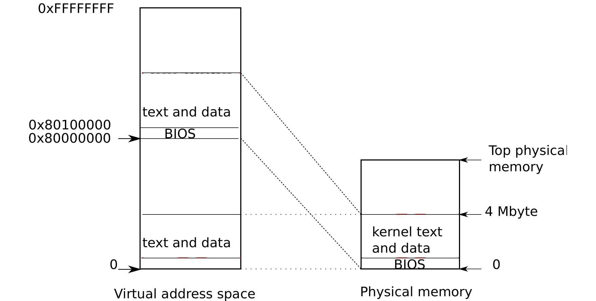

# Code: the first address space

> 来源：book-rev7.pdf，第 17–24 页（英文原文）

Figure 1-2. Layout of a virtual address space

When a PC powers on, it initializes itself and then loads a boot loader from disk into memory and executes it. Appendix B explains the details. Xv6’s boot loader loads the xv6 kernel from disk and executes it starting at entry (1040). The x86 paging hardware is not enabled when the kernel starts; virtual addresses map directly to physical addresses.

The boot loader loads the xv6 kernel into memory at physical address 0x100000. The reason it doesn’t load the kernel at 0x80100000, where the kernel expects to find its instructions and data, is that there may not be any physical memory at such a high address on a small machine. The reason it places the kernel at 0x100000 rather than 0x0 is because the address range 0xa0000:0x100000 contains I/O devices.

To allow the rest of the kernel to run, entry sets up a page table that maps virtual addresses starting at 0x80000000 (called KERNBASE (0207)) to physical addresses starting at 0x0 (see Figure 1-1). Setting up two ranges of virtual addresses that map to the same physical memory range is a common use of page tables, and we will see more examples like this one.

The entry page table is defined in main.c (1311). We look at the details of page tables in Chapter 2, but the short story is that entry 0 maps virtual addresses 0:0x400000 to physical addresses 0:0x400000. This mapping is required as long as entry is executing at low addresses, but will eventually be removed.

Entry 960 maps virtual addresses KERNBASE:KERNBASE+0x400000 to physical addresses 0:0x400000. This entry will be used by the kernel after entry has finished; it maps the high virtual addresses at which the kernel expects to find its instructions and data to the low physical addresses where the boot loader loaded them. This mapping restricts the kernel instructions and data to 4 Mbytes.

Returning to entry, it loads the physical address of entrypgdir into control register %cr3. The paging hardware must know the physical address of entrypgdir, because it doesn’t know how to translate virtual addresses yet; it doesn’t have a page table yet. The symbol entrypgdir refers to an address in high memory, and the macro V2P_WO (0220) subtracts KERNBASE in order to find the physical address. To enable the paging hardware, xv6 sets the flag CR0_PG in the control register %cr0.

The processor is still executing instructions at low addresses after paging is enabled, which works since entrypgdir maps low addresses. If xv6 had omitted entry 0 from entrypgdir, the computer would have crashed when trying to execute the instruction after the one that enabled paging.

Now entry needs to transfer to the kernel’s C code, and run it in high memory. First it makes the stack pointer, %esp, point to memory to be used as a stack (1054). All symbols have high addresses, including stack, so the stack will still be valid even when the low mappings are removed. Finally entry jumps to main, which is also a high address. The indirect jump is needed because the assembler would otherwise generate a PC-relative direct jump, which would execute the low-memory version of main. Main cannot return, since the there’s no return PC on the stack. Now the kernel is running in high addresses in the function main (1217).
