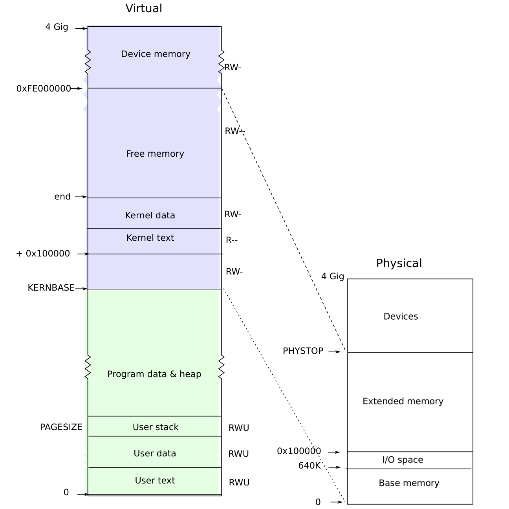

# Process address space

> 来源：book-rev7.pdf，第 25–32 页（英文原文）

The page table created by entry has enough mappings to allow the kernel’s C code to start running. However, main immediately changes to a new page table by calling kvmalloc (1757), because kernel has a more elaborate plan for describing process address spaces.

Each process has a separate page table, and xv6 tells the page table hardware to switch page tables when xv6 switches between processes. As shown in Figure 2-2, a process’s user memory starts at virtual address zero and can grow up to KERNBASE, allowing a process to address up to 2 GB of memory. When a process asks xv6 for more memory, xv6 first finds free physical pages to provide the storage, and then adds

Figure 2-2. Layout of a virtual address space and the physical address space.

PTEs to the process’s page table that point to the new physical pages. xv6 sets the PTE_U, PTE_W, and PTE_P flags in these PTEs. Most processes do not use the entire user address space; xv6 leaves PTE_P clear in unused PTEs. Different processes’ page tables translate user addresses to different pages of physical memory, so that each process has private user memory.

Xv6 includes all mappings needed for the kernel to run in every process’s page table; these mappings all appear above KERNBASE. It maps virtual addresses KERNBASE:KERNBASE+PHYSTOP to 0:PHYSTOP. One reason for this mapping is so that the kernel can use its own instructions and data. Another reason is that the kernel sometimes needs to be able to write a given page of physical memory, for example when creating page table pages; having every physical page appear at a predictable virtual address makes this convenient. A defect of this arrangement is that xv6 cannot make use of more than 2 GB of physical memory. Some devices that use memory-mapped I/O appear at physical addresses starting at 0xFE000000, so xv6 page tables including a direct mapping for them. Xv6 does not set the PTE_U flag in the PTEs above KERNBASE, so only the kernel can use them.

Having every process’s page table contain mappings for both user memory and the entire kernel is convenient when switching from user code to kernel code during system calls and interrupts: such switches do not require page table switches. For the most part the kernel does not have its own page table; it is almost always borrowing some process’s page table.

To review, xv6 ensures that each process can only use its own memory, and that each process sees its memory as having contiguous virtual addresses starting at zero. xv6 implements the first by setting the PTE_U bit only on PTEs of virtual addresses that refer to the process’s own memory. It implements the second using the ability of page tables to translate successive virtual addresses to whatever physical pages happen to be allocated to the process.
