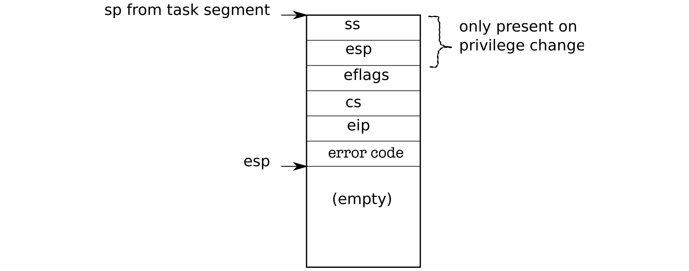

# X86 protection

> 来源：book-rev7.pdf，第 33–44 页（英文原文）

The x86 has 4 protection levels, numbered 0 (most privilege) to 3 (least privilege). In practice, most operating systems use only 2 levels: 0 and 3, which are then called kernel mode and user mode, respectively. The current privilege level with which the x86 executes instructions is stored in %cs register, in the field CPL. On the x86, interrupt handlers are defined in the interrupt descriptor table (IDT). The IDT has 256 entries, each giving the %cs and %eip to be used when handling the corresponding interrupt. To make a system call on the x86, a program invokes the int n instruction, where n specifies the index into the IDT. The int instruction performs the following steps: • Fetch the n ’th descriptor from the IDT, where n is the argument of int. • Check that CPL in %cs is <= DPL, where DPL is the privilege level in the descriptor. • Save %esp and %ss in a CPU-internal registers, but only if the target segment selector’s PL < CPL. • Load %ss and %esp from a task segment descriptor. • Push %ss. sp from task segment ss only present on esp privilege change eflags cs eip error code esp (empty) 

Figure 3-1. Kernel stack after an int instruction. • Push %esp. • Push %eflags. • Push %cs. • Push %eip. • Clear some bits of %eflags. • Set %cs and %eip to the values in the descriptor. The int instruction is a complex instruction, and one might wonder whether all these actions are necessary. The check CPL <= DPL allows the kernel to forbid systems for some privilege levels. For example, for a user program to execute int instruction succesfully, the DPL must be 3. If the user program doesn’t have the appropriate privilege, then int instruction will result in int 13, which is a general protection fault. As another example, the int instruction cannot use the user stack to save values, because the user might not have set up an appropriate stack so that hardware uses the stack specified in the task segments, which is setup in kernel mode. Figure 3-1 shows the stack after an int instruction completes and there was a privilege-level change (the privilege level in the descriptor is lower than CPL). If the int instruction didn’t require a privilege-level change, the x86 won’t save %ss and %esp. After both cases, %eip is pointing to the address specified in the descriptor table, and the instruction at that address is the next instruction to be executed and the first instruction of the handler for int n. It is job of the operating system to implement these handlers, and below we will see what xv6 does. An operating system can use the iret instruction to return from an int instruction. It pops the saved values during the int instruction from the stack, and resumes execution at the saved %eip.
