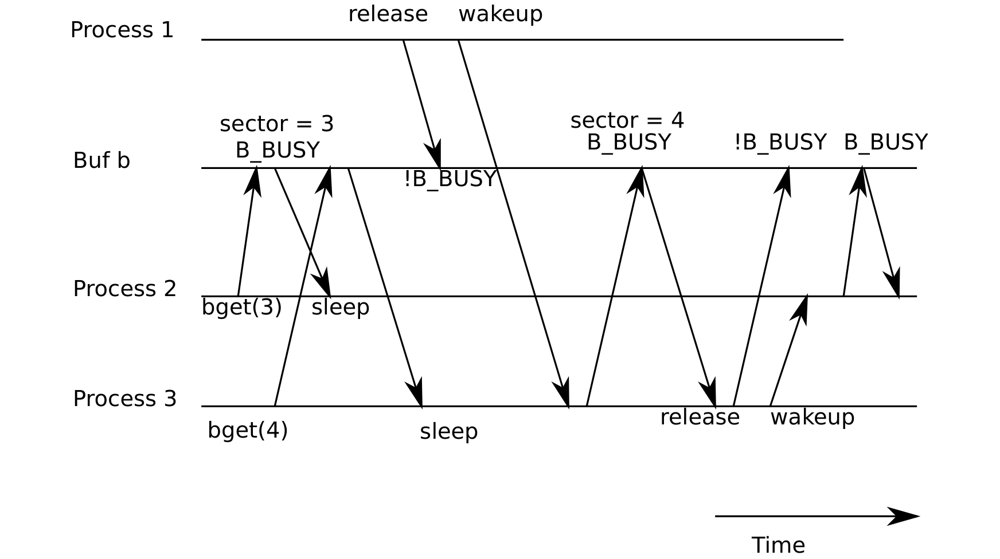

# Code: Buffer cache

> 来源：book-rev7.pdf，第 67–81 页（英文原文）

The buffer cache is a doubly-linked list of buffers. The function binit, called by main (1231), initializes the list with the NBUF buffers in the static array buf (4050-4059). All other access to the buffer cache refers to the linked list via bcache.head, not the buf array.

A buffer has three state bits associated with it. B_VALID indicates that the buffer contains a valid copy of the block. B_DIRTY indicates that the buffer content has been modified and needs to be written to the disk. B_BUSY indicates that some kernel thread has a reference to this buffer and has not yet released it.

Bread (4102) calls bget to get a buffer for the given sector (4106). If the buffer needs to be read from disk, bread calls iderw to do that before returning the buffer.

Bget (4066) scans the buffer list for a buffer with the given device and sector numbers (4073-4084). If there is such a buffer, and the buffer is not busy, bget sets the B_BUSY flag and returns (4076-4083). If the buffer is already in use, bget sleeps on the buffer to wait for its release. When sleep returns, bget cannot assume that the buffer is now available. In fact, since sleep released and reacquired buf_table_lock, there is no guarantee that b is still the right buffer: maybe it has been reused for a different disk sector. Bget has no choice but to start over (4082), hoping that the outcome will be different this time.

If bget didn’t have the goto statement, then the race in Figure 6-3 could occur. The first process has a buffer and has loaded sector 3 in it. Now two other processes come along. The first one does a get for buffer 3 and sleeps in the loop for cached blocks. The second one does a get for buffer 4, and could sleep on the same buffer but in the loop for freshly allocated blocks because there are no free buffers and the buffer that holds 3 is the one at the front of the list and is selected for reuse. The first process releases the buffer and wakeup happens to schedule process 3 first, and it will grab the buffer and load sector 4 in it. When it is done it will release the buffer (containing sector 4) and wakeup process 2. Without the goto statement process 2 will mark the buffer BUSY, and return from bget, but the buffer contains sector 4, instead of 3. This error could result in all kinds of havoc, because sectors 3 and 4 have different content; xv6 uses them for storing inodes.

If there is no buffer for the given sector, bget must make one, possibly reusing a buffer that held a different sector. It scans the buffer list a second time, looking for a block that is not busy: any such block can be used. Bget edits the block metadata to record the new device and sector number and mark the block busy before returning the block (4091-4093). Note that the assignment to flags not only sets the B_BUSY bit but also clears the B_VALID and B_DIRTY bits, making sure that bread will refresh the

Figure 6-3. A race resulting in process 3 receiving a buffer containing block 4, even though it asked for

block 3. buffer data from disk rather than use the previous block’s contents.

Because the buffer cache is used for synchronization, it is important that there is only ever one buffer for a particular disk sector. The assignments (4089-4091) are only safe because bget ’s first loop determined that no buffer already existed for that sector, and bget has not given up buf_table_lock since then.

If all the buffers are busy, something has gone wrong: bget panics. A more graceful response might be to sleep until a buffer became free, though there would then be a possibility of deadlock.

Once bread has returned a buffer to its caller, the caller has exclusive use of the buffer and can read or write the data bytes. If the caller does write to the data, it must call bwrite to write the changed data to disk before releasing the buffer. Bwrite (4114) sets the B_DIRTY flag and calls iderw to write the buffer to disk.

When the caller is done with a buffer, it must call brelse to release it. (The name brelse, a shortening of b-release, is cryptic but worth learning: it originated in Unix and is used in BSD, Linux, and Solaris too.) Brelse (4125) moves the buffer from its position in the linked list to the front of the list (4132-4137), clears the B_BUSY bit, and wakes any processes sleeping on the buffer. Moving the buffer has the effect that the buffers are ordered by how recently they were used (meaning released): the first buffer in the list is the most recently used, and the last is the least recently used. The two loops in bget take advantage of this: the scan for an existing buffer must process the entire list in the worst case, but checking the most recently used buffers first (starting at bcache.head and following next pointers) will reduce scan time when there is good locality of reference. The scan to pick a buffer to reuse picks the least recently used block by scanning backward (following prev pointers).
