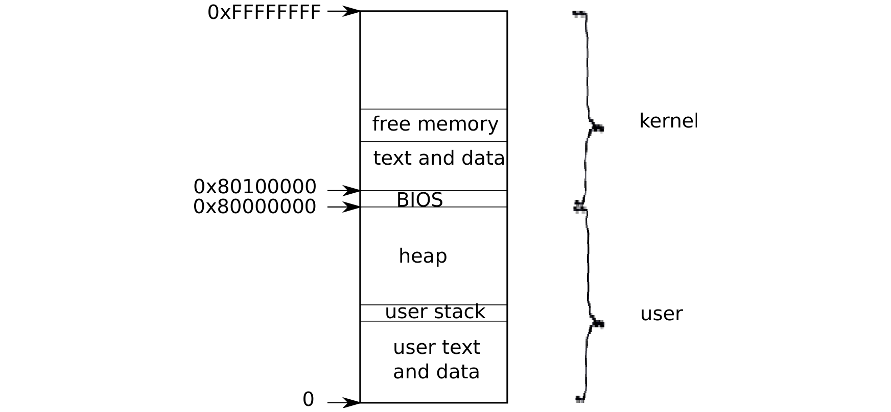

# 进程概述

> 来源：book-rev7.pdf，第 17–24 页（中文翻译）

进程是一种抽象，它向程序提供一种错觉，使它认为自己拥有一台专属的抽象机器。进程为程序提供一套看似私有的内存系统，即地址空间，其他进程不能读写它。进程还为程序提供看似属于自己的 CPU 来执行程序的指令。

xv6 使用页表（由硬件实现）为每个进程提供独立的地址空间。x86 页表把虚拟地址（x86 指令操作的地址）翻译（或“映射”）为物理地址（处理器芯片发送到主内存的地址）。

xv6 为每个进程维护一张独立的页表，定义该进程的地址空间。如图 1-1 所示，地址空间包含从虚拟地址零开始的进程用户内存：指令在最前面，之后是全局变量，然后是栈，最后是一个“堆”区域（供 malloc 使用），进程可以根据需要扩展它。

每个进程的地址空间不仅映射用户程序的内存，也映射内核的指令和数据。当进程发起系统调用时，系统调用在进程地址空间的内核映射中执行。这种安排的存在是为了让内核的系统调用代码能直接引用用户内存。为了给用户内存的扩展留出空间，xv6 的地址空间把内核映射在高地址，从 0x80100000 开始。

xv6 内核为每个进程维护许多状态信息，并将其汇集到一个 struct proc（2103）中。进程最重要的内核状态是页表、内核栈和运行状态。我们将使用 p->xxx 这种记号来指代 proc 结构中的元素。

（图 1-1：虚拟地址空间的布局——底部为 0，向上依次是用户文本与数据、用户栈、堆、空闲内存，0x80000000 处为 BIOS 映射，0x80100000 以上为内核文本与数据，最高为 0xFFFFFFFF。）

每个进程都有一条执行线程（简称线程）来执行进程的指令。线程可以被挂起，之后恢复执行。为了在进程之间透明地切换，内核挂起当前运行的线程，并恢复另一个进程的线程。线程的大部分状态（局部变量、函数调用返回地址）都存储在线程的栈上。每个进程有两个栈：用户栈和内核栈（p->kstack）。当进程执行用户指令时，只有用户栈被使用，内核栈是空的。当进程进入内核（通过系统调用或中断）时，内核代码在进程的内核栈上执行；进程在内核中时，其用户栈仍保存着数据，但没有被使用。进程的线程在主动使用用户栈和内核栈之间交替。内核栈是分离的（并且对用户代码受保护），因此即使进程破坏了它的用户栈，内核也能继续执行。

当进程发出系统调用时，处理器切换到内核栈，提升硬件特权级别，并开始执行实现系统调用的内核指令。系统调用完成后，内核返回用户空间：硬件降低特权级别，切换回用户栈，并在系统调用指令之后恢复执行用户指令。进程的线程可以在内核中“阻塞”以等待 I/O，并在 I/O 完成后从暂停处继续执行。

p->state 表示进程是已分配、就绪可运行、正在运行、等待 I/O 还是正在退出。

p->pgdir 保存进程的页表，格式与 x86 硬件期望的相同。xv6 在执行该进程时，使分页硬件使用进程的 p->pgdir。进程的页表同时也记录了为存储进程内存而分配的物理页的地址。