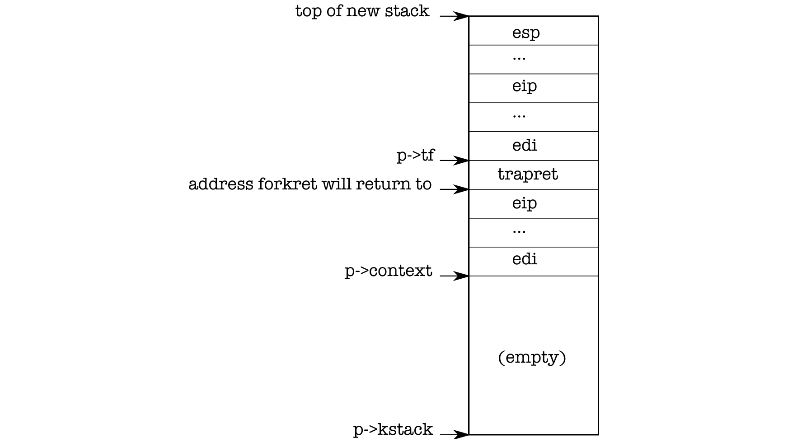

# 代码：创建第一个进程

> 来源：book-rev7.pdf，第 17–24 页（中文翻译）

在 main 初始化若干设备和子系统之后，它通过调用 userinit (1239) 创建第一个进程。userinit 的第一个动作是调用 allocproc。allocproc (2205) 的工作是在进程表中分配一个槽位（一个 struct proc），并初始化进程内核线程执行所需的状态部分。每个新进程都会调用 allocproc，而 userinit 只在创建第一个进程时调用一次。

allocproc 扫描 proc 表，查找状态为 UNUSED 的槽位 (2211-2213)。当它找到未使用的槽位时，allocproc 将状态设置为 EMBRYO 以标记为已使用，并为该进程分配一个唯一的 pid (2201-2219)。接下来，它尝试为进程的内核线程分配内核栈。如果内存分配失败，allocproc 将状态改回 UNUSED 并返回零以指示失败。

现在 allocproc 必须设置新进程的内核栈。allocproc 被设计为既能被 fork 使用，也能用于创建第一个进程。allocproc 为内新建进程配备一个特殊准备的内核栈和一套内核寄存器，使它在首次运行时“返回”到用户空间。准备好的内核栈的布局如图 1-3 所示。allocproc 通过设置返回程序计数器值来完成部分工作，这些值将使新进程的内核线程首先在 forkret 中执行，然后在 trapret 中执行 (2236-2241)。内核线程将使用从 p->context 复制的寄存器内容开始执行。因此，将 p->context->eip 设置为 forkret 将导致内核线程在 forkret (2533) 的开头执行。此函数将返回到栈底部保存的任何地址。上下文切换代码 (2708) 将栈指针设置为恰好指向 p->context 末尾之后。allocproc 把 p->context 放在栈上，并在它上面放一个指向 trapret 的指针；forkret 将返回到那里。trapret 从内核栈顶存储的值恢复用户寄存器并跳入进程 (3027)。这个设置对普通 fork 和创建第一个进程是相同的，只不过在第一种情况下进程将从用户空间位置 0 开始执行，而不是从 fork 返回处开始执行。

（图 1-3：一个新的内核栈——从 p->kstack 向上：空、p->context（edi…eip）、trapret（forkret 要返回的地址）、p->tf、esp 指向新栈顶部。）

正如我们将在第 3 章看到的，控制从用户软件转移到内核的方式是通过中断机制，系统调用、中断和异常都使用它。每当控制进入内核而进程正在运行时，硬件和 xv6 的中断入口代码会把用户寄存器保存在进程的内核栈上。userinit 在新栈顶部写入的值，与进程通过中断进入内核时留在那里的值完全一致 (2264-2270)，这样，从内核返回进程用户代码的普通代码就能正常工作。这些值是一个 struct trapframe，用于保存用户寄存器。此时，新进程的内核栈已完全准备好，如图 1-3 所示。

第一个进程将执行一个很小的程序（initcode.S；7700）。进程需要物理内存来存放这个程序，程序需要被复制到该内存，并且进程需要一张指向该内存的页表。

userinit 调用 setupkvm (1737) 为进程创建页表，初始时只映射内核使用的内存。我们将在第 2 章详细研究这个函数，但概略而言，setupkvm 和 userinit 创建了一个如图 1-1 所示的地址空间。

第一个进程内存的初始内容是 initcode.S 的编译形式。作为内核构建过程的一部分，链接器把该二进制嵌入内核，并定义了两个特殊符号 _binary_initcode_start 和 _binary_initcode_size，表示该二进制的位置和大小。userinit 通过调用 inituvm 将该二进制复制到新进程的内存中，inituvm 分配一页物理内存，把虚拟地址 0 映射到该内存，并将二进制复制到该页 (1803)。

然后 userinit 设置 trapframe（trap frame，0602）为初始用户模式状态：%cs 寄存器包含 SEG_UCODE 段的段选择子，运行在 DPL_USER 特权级（即用户模式而非内核模式）下；类似地，%ds、%es 和 %ss 使用 DPL_USER 特权级的 SEG_UDATA。设置 %eflags 的 FL_IF 位以允许硬件中断；我们将在第 3 章重新讨论这一点。

栈指针 %esp 被设置为进程的最大有效虚拟地址 p->sz。指令指针被设置为 initcode 的入口点，即地址 0。

函数 userinit 将 p->name 设置为 initcode，主要用于调试。设置 p->cwd 即设置进程的当前工作目录；我们将在第 6 章详细讨论 namei。

一旦进程初始化完成，userinit 通过设置 p->state 为 RUNNABLE 将其标记为可调度状态。