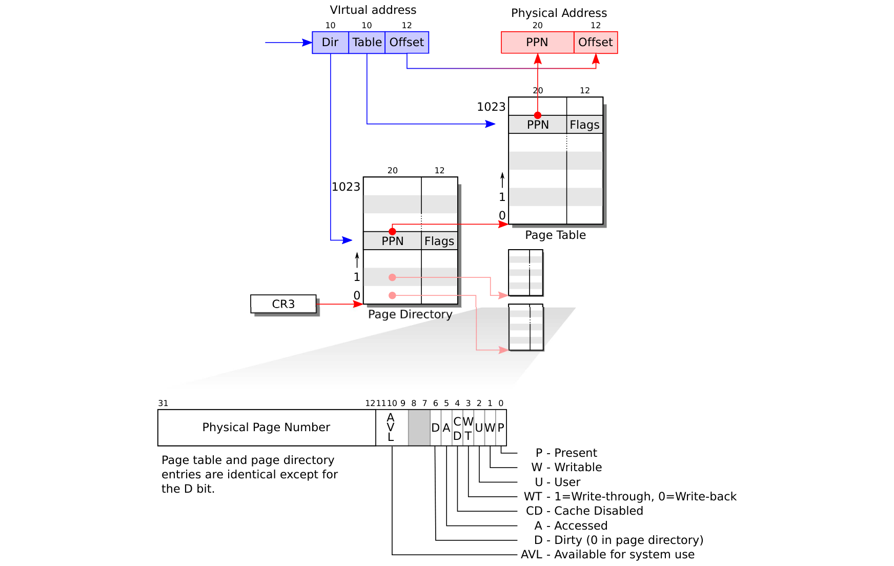

# 分页硬件

> 来源：book-rev7.pdf，第 25–32 页（中文翻译）

提醒一下：x86 指令（用户和内核的）操作虚拟地址。机器的 RAM，即物理内存，用物理地址索引。x86 页表硬件通过把每个虚拟地址映射到一个物理地址，把这两种地址连接起来。

x86 页表逻辑上是一个包含 2^20（1,048,576）个页表项（PTE）的数组。每个 PTE 包含一个 20 位的物理页号（PPN）和一些标志。分页硬件翻译虚拟地址时，用其高 20 位索引页表找到 PTE，并用 PTE 中的 PPN 替换地址的高 20 位。分页硬件把低 12 位从虚拟地址原样复制到翻译后的物理地址。因此页表让操作系统能够以 4096（2^12）字节对齐块为粒度控制虚拟地址到物理地址的翻译。这样的块称为页。

如图 2-1 所示，实际的翻译分两步进行。页表以两级树的形式存储在物理内存中。树的根是一个 4096 字节的页目录，包含 1024 个类似 PTE 的引用，指向页表页。每个页表页是 1024 个 32 位 PTE 的数组。分页硬件用虚拟地址的高 10 位选择一个页目录项。如果页目录项存在，分页硬件用虚拟地址的接下来 10 位，从页目录项引用的页表页中选择一个 PTE。如果页目录项或 PTE 任一不存在，分页硬件产生一个故障。这种两级结构允许页表在大范围虚拟地址没有映射的常见情况下，省略整张页表页。

（图 2-1：x86 页表硬件——虚拟地址分为 Dir 10 位、Table 10 位、Offset 12 位；物理地址分为 PPN 20 位、Offset 12 位；CR3 指向页目录。）

每个 PTE 包含标志位，告诉分页硬件如何使用相关的虚拟地址。PTE_P 表示 PTE 是否存在：如果未设置，引用该页会导致故障（即不允许）。PTE_W 控制是否允许指令向该页发出写操作；如果未设置，只允许读取和指令获取。PTE_U 控制用户程序是否允许使用该页；如果清除，只有内核允许使用该页。图 2-1 展示了这一切如何工作。这些标志及所有其他页硬件相关结构定义在 mmu.h (0200) 中。

关于术语的几点说明。物理内存指 DRAM 中的存储单元。物理内存的一个字节有一个地址，称为物理地址。指令只使用虚拟地址，分页硬件将其翻译为物理地址，然后发送到 DRAM 硬件进行读写。在这个讨论层次上，不存在所谓的虚拟内存，只有虚拟地址。