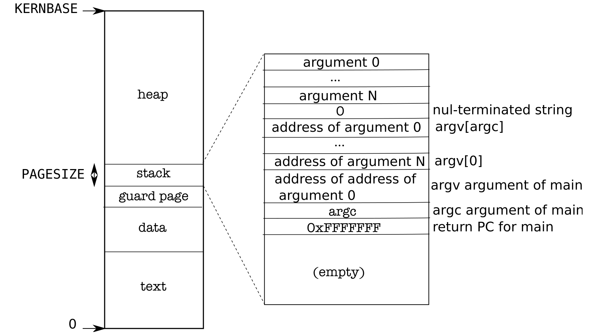

# 地址空间的用户部分

> 来源：book-rev7.pdf，第 25–32 页（中文翻译）

图 2-3 展示了 xv6 中执行进程用户内存的布局。堆在栈的上方，以便它能够扩展（用 sbrk）。栈是单独一页，图中显示的是 exec 创建的初始内容。

（图 2-3：用户进程的内存布局及其初始栈——最底部为文本，向上依次为数据、argc、main 的返回 PC 0xFFFFFFF、guard page、栈页（顶部为参数数组、字符串）、堆、直到 KERNBASE。）

包含命令行参数的字符串以及指向它们的指针数组位于栈的最顶端。就在其下方，是允许程序从 main 开始执行的值，仿佛函数调用 main(argc, argv) 刚刚开始。为了防范栈向下增长超出栈页，xv6 在栈的正下方放置一个 guard page（保护页）。该保护页未被映射，因此如果栈越出了栈页，硬件将因为无法翻译出错的地址而产生异常。