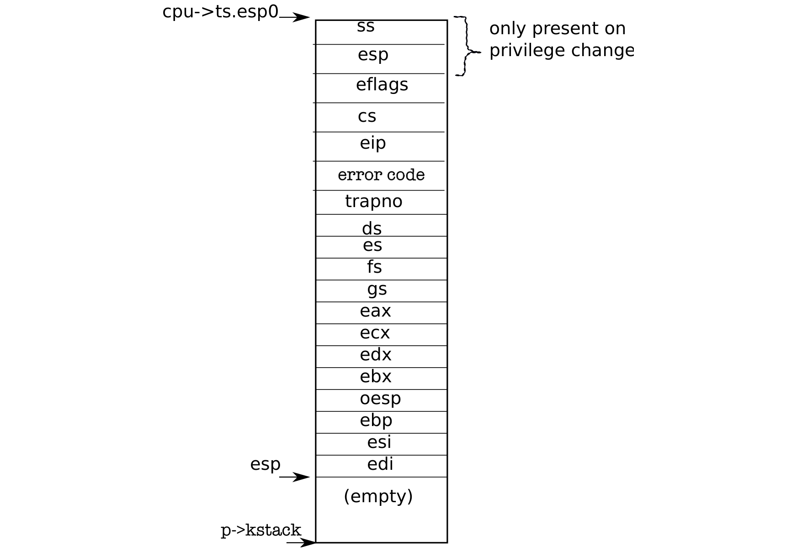

# 代码：汇编 trap 处理程序

> 来源：book-rev7.pdf，第 33–44 页（中文翻译）

xv6 必须让 x86 硬件在遇到 int 指令时做出合理的动作，int 指令使处理器产生一个 trap。x86 允许 256 种不同的中断。中断 0-31 定义为软件异常，如除法错误或访问无效内存地址。xv6 把 32 个硬件中断映射到 32-63 范围，并用中断 64 作为系统调用中断。

tvinit (3067) 从 main 调用，建立 idt 表中的 256 个条目。中断 i 由 vectors[i] 中地址处的代码处理。每个入口点都不同，因为 x86 不向中断处理程序提供 trap 号。使用 256 个不同的处理程序是区分 256 种情况的唯一方法。

tvinit 特殊处理用户系统调用 trap T_SYSCALL：它通过传第二个参数值 1，指定门类型为“trap”。trap 门不清除 FL_IF 标志，允许在系统调用处理程序执行期间发生其他中断。内核还把系统调用门特权设置为 DPL_USER，允许用户程序用显式 int 指令产生该 trap。xv6 不允许进程用 int 产生其他中断（如设备中断）；如果它们尝试，会遇到一般保护异常，进入 vector 13。

当特权级别从用户模式改为内核模式时，内核不应该使用用户进程的栈，因为它可能无效。用户进程可能是恶意的或包含错误，导致用户 %esp 包含不属于进程用户内存的地址。xv6 通过设置任务段描述符来编程 x86 硬件在 trap 时执行栈切换，硬件通过该描述符加载栈段选择子和 %esp 的新值。函数 switchuvm (1773) 把用户进程内核栈顶的地址存储到任务段描述符中。

当 trap 发生时，处理器硬件执行以下操作。如果处理器正在用户模式执行，它从任务段描述符加载 %esp 和 %ss，把旧的用户 %ss 和 %esp 压入新栈。如果处理器正在内核模式执行，以上都不发生。然后处理器压入 %eflags、%cs 和 %eip 寄存器。对于某些 trap，处理器还压入一个错误字。最后，处理器从相关 IDT 条目加载 %eip 和 %cs。

（图 3-2：内核栈上的 trapframe——底部为空，向上依次为 edi、esi、esp(0)、oesp、ebx、edx、ecx、eax、gs、fs、es、ds、trapno、eip、cs、eflags、esp（仅特权级变化）、ss（仅特权级变化）；cpu->ts.esp0 指向 p->kstack 顶部。）

xv6 用 Perl 脚本 (2950) 生成 IDT 条目指向的入口点。每个入口在处理器没有压入错误代码时压入一个错误代码，压入中断号，然后跳转到 alltraps。

alltraps (3004) 继续保存处理器寄存器：它压入 %ds、%es、%fs、%gs 和通用寄存器 (3005-3010)。经过这些努力，内核栈现在包含一个 struct trapframe (0602)，其中保存了 trap 发生时处理器的寄存器（见图 3-2）。处理器压入 %ss、%esp、%eflags、%cs 和 %eip。处理器或 trap 向量压入错误号，alltraps 压入其余部分。trap frame 包含恢复当前进程用户模式处理器寄存器所需的全部信息，以便当内核返回到当前进程时，处理器能精确地从 trap 开始处继续执行。回顾第 2 章，userinit 手工构建 trapframe 以实现这一目标（见图 1-3）。

在第一个系统调用的情况下，保存的 %eip 是 int 指令后紧邻指令的地址。%cs 是用户代码段选择子。%eflags 是执行 int 指令时 eflags 寄存器的内容。作为保存通用寄存器的一部分，alltraps 还保存 %eax，其中包含内核稍后要检查的系统调用号。

现在用户模式处理器寄存器已保存，alltraps 可以完成设置处理器以运行内核 C 代码。CPU 在进入处理程序之前已经设置了选择子 %cs 和 %ss；alltraps 设置 %ds 和 %es (3013-3015)。它将 %fs 和 %gs 指向 SEG_KCPU 每 CPU 数据段 (3016-3018)。

段设置完成后，alltraps 可以调用 C 的 trap 处理程序。它压入 %esp，指向刚构造的 trap frame，作为 trap (3021) 的参数。然后调用 trap (3022)。trap 返回后，alltraps 通过给栈指针增加偏移量弹出该参数 (3023)，并开始执行标签 trapret 处的代码。我们在第 2 章中已经追踪过这段代码，当时第一个用户进程运行它以退出到用户空间。这里发生相同的序列：弹出 trap frame 恢复用户模式寄存器，然后 iret 跳回用户空间。

到目前为止的讨论都关于在用户模式中发生的 trap，但 trap 也可能在内核执行期间发生。在这种情况下，硬件不切换栈，也不保存栈指针或栈段选择子；除此之外，与用户模式的 trap 执行相同的步骤，并执行相同的 xv6 trap 处理代码。当 iret 随后恢复内核模式的 %cs 时，处理器在内核模式下继续执行。