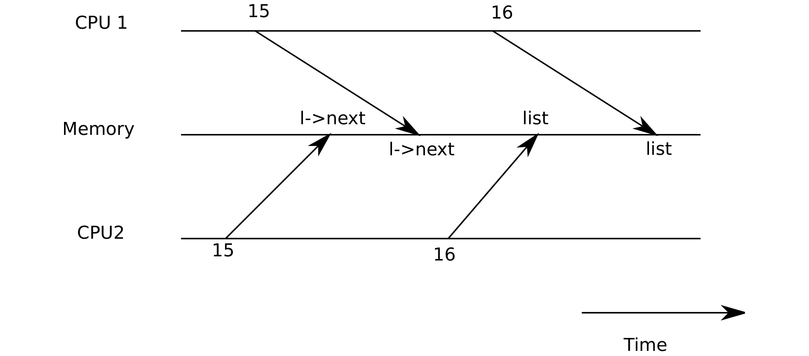

# 竞态条件

> 来源：book-rev7.pdf，第 45–52 页（中文翻译）

作为为什么需要锁的例子，考虑多个处理器共享单个磁盘，比如 xv6 中的 IDE 磁盘。磁盘驱动维护一个未完成磁盘请求的链表 (3821)，处理器可以并发地把新请求添加到链表中 (3954)。如果没有并发请求，可以像下面这样实现链表：

```c
1 struct list {
2 int data;
3 struct list *next;
4 };
5
6 struct list *list = 0;
7
8 void
9 insert(int data)
10 {
11 struct list *l;
12
13 l = malloc(sizeof *l);
14 l->data = data;
15 l->next = list;
16 list = l;
17 }
```



（图 4-1：一个竞态例子——CPU 1 与 CPU 2 同时执行第 15、16 行，两个节点的 next 都指向旧 list 值，最后 list 指向其中一个节点，另一个节点丢失。）

在数据结构与算法课程中，证明这个实现正确是一个典型的练习。尽管这个实现可以被证明正确，但它在多处理器上不成立。如果两个不同的 CPU 同时执行 insert，可能两个 CPU 都在执行 16 之前执行了第 15 行（见图 4-1）。如果发生这种情况，将有两个链表节点的 next 指向 list 的旧值。当两个 list 赋值在第 16 行发生时，第二个会覆盖第一个；第一次赋值涉及的节点将丢失。这类问题称为竞态条件。竞态的问题在于它们取决于两个 CPU 的精确时序以及内存系统如何对它们的内存操作排序，因此很难复现。例如，调试 insert 时添加打印语句可能会改变执行的时序，足以使竞态消失。

避免竞态的典型方法是使用锁。锁确保互斥，因此同一时刻只有一个 CPU 能执行 insert；这使上述情况不可能发生。上面代码的正确加锁版本只增加了几行（未编号）：

```c
6 struct list *list = 0;
struct lock listlock;
7
8 void
9 insert(int data)
10 {
11 struct list *l;
12
acquire(&listlock);
13 l = malloc(sizeof *l);
14 l->data = data;
15 l->next = list;
16 list = l;
release(&listlock);
17 }
```

当我们说锁保护数据时，我们真正指的是锁保护适用于数据的一组不变式。不变式是在所有操作中维持的数据结构属性。通常，操作的正确行为依赖于操作开始时不变式成立。操作可以暂时违反不变式，但必须在完成前重新建立它们。例如，链表的情况，不变式是 list 指向链表的第一个节点，并且每个节点的 next 字段指向下一个节点。insert 的实现暂时违反了这个不变式：第 13 行创建了链表元素 l，意图使 l 成为链表的第一个节点，但 l 的 next 指针尚未指向链表中下一个节点（在第 15 行重新建立），list 也尚未指向 l（在第 16 行重新建立）。我们上面分析的竞态之所以发生，是因为第二个 CPU 在链表不变式被（暂时）违反时执行了依赖链表不变式的代码。正确使用锁可以确保同一时刻只有一个 CPU 操作数据结构，这样任何 CPU 都不会在数据结构不变式不成立时执行数据结构操作。