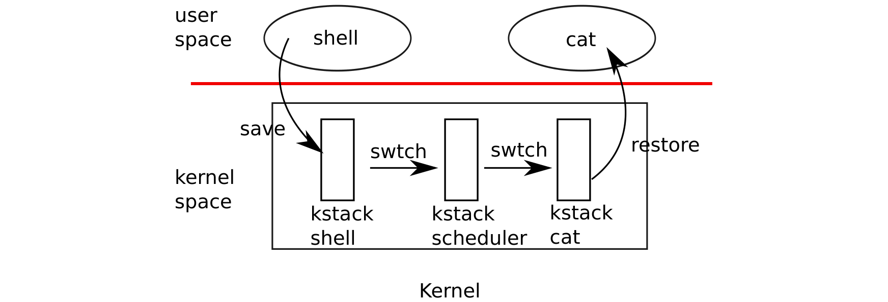

# 代码：上下文切换

> 来源：book-rev7.pdf，第 53–66 页（中文翻译）

（图 5-1：从一个用户进程切换到另一个——用户空间中 shell 和 cat 通过 swtch 保存/恢复；内核空间中三个栈 kstack：shell、scheduler、cat；本例中 xv6 运行在单个 CPU 上，因此只有一个调度器线程。）

如图 5-1 所示，为了在进程之间切换，xv6 在低层执行两种上下文切换：从进程的内核线程切换到当前 CPU 的调度器线程，以及从调度器线程切换到新进程的内核线程。xv6 从不直接从一个用户空间进程切换到另一个；这种切换通过用户-内核转换（系统调用或中断）、切换到调度器的上下文切换、切换到新进程内核线程的上下文切换以及 trap 返回来实现。本节我们将研究内核线程与调度器线程之间切换的机制。

如第 2 章所见，每个 xv6 进程都有自己的内核栈和寄存器组。每个 CPU 都有一个独立的调度器线程，用于执行调度器而不是任何进程的内核线程。从一个线程切换到另一个线程包括保存旧线程的 CPU 寄存器，并恢复新线程之前保存的寄存器；%esp 和 %eip 被保存和恢复的事实意味着 CPU 会切换栈并切换正在执行的代码。

swtch 不直接知道线程；它只是保存和恢复寄存器集合，称为上下文。当进程需要让出 CPU 时，进程的内核线程会调用 swtch 来保存自己的上下文并返回到调度器上下文。每个上下文用一个 struct context* 表示，是指向内核栈上保存的结构的指针。Swtch 接受两个参数：struct context **old 和 struct context *new。它把当前 CPU 寄存器压入栈，并将栈指针保存在 *old 中。然后 swtch 把 new 复制到 %esp，弹出先前保存的寄存器，并返回。

我们不跟踪调度器进入 swtch，而是跟随用户进程返回。我们在第 3 章看到，每个中断结束时的一种可能是 trap 调用 yield。yield 进而调用 sched，sched 调用 swtch 将当前上下文保存在 proc->context 中，并切换到先前保存在 cpu->scheduler (2516) 中的调度器上下文。

Swtch (2702) 首先从栈上加载其参数到寄存器 %eax 和 %edx (2709-2710)；swtch 必须在改变栈指针之前完成这些操作，因为之后无法再通过 %esp 访问参数。然后 swtch 压入寄存器状态，在当前栈上创建一个 context 结构。只需保存被调用者保存的寄存器；x86 上的约定是 %ebp、%ebx、%esi、%ebp 和 %esp。

Swtch 显式压入前四个 (2713-2716)；它隐式保存最后一个，即把 struct context* 写入 *old (2719)。还有一个重要的寄存器：调用 swtch 的 call 指令已经保存了程序计数器 %eip，它位于栈上 %ebp 正上方。保存了旧上下文后，swtch 准备好恢复新上下文。它将新上下文的指针移动到栈指针 (2720)。新栈与 swtch 刚离开的旧栈形式相同——新栈是先前对 swtch 调用时的旧栈——因此 swtch 可以反转序列来恢复新上下文。它弹出 %edi、%esi、%ebx 和 %ebp 的值，然后返回 (2723-2727)。由于 swtch 改变了栈指针，恢复的寄存器和返回的指令地址都来自新上下文。

在我们的例子中，sched 调用 swtch 切换到 cpu->scheduler，即每 CPU 的调度器上下文。该上下文先前由调度器对 swtch 的调用保存 (2478)。当我们追踪的 swtch 返回时，它不会返回到 sched，而是返回到 scheduler，其栈指针指向当前 CPU 的调度器栈，而不是 initproc 的内核栈。