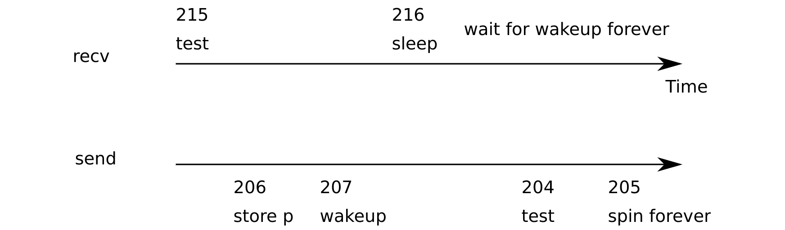

# 睡眠与唤醒

> 来源：book-rev7.pdf，第 53–66 页（中文翻译）

锁帮助 CPU 和进程避免互相干扰，调度帮助进程共享 CPU，但到目前为止我们还没有使进程之间轻松通信的抽象。sleep 和 wakeup 填补了这一空白，允许一个进程睡眠等待某个事件，另一个进程在事件发生后将其唤醒。sleep 和 wakeup 常被称为序列协调（sequence coordination）或条件同步（conditional synchronization）机制，操作系统文献中还有许多其他这样的机制。

为了说明我们的意思，考虑一个简单的生产者/消费者队列。该队列类似于 IDE 驱动用来同步处理器和设备驱动的队列（见第 3 章），但抽象掉了所有 IDE 特定代码。队列允许一个进程向另一个进程发送一个非零指针。假设只有一个发送者和一个接收者，它们运行在不同 CPU 上，这个实现是正确的：

```c
100 struct q {
101 void *ptr;
102 };
103
104 void*
105 send(struct q *q, void *p)
106 {
107 while(q->ptr != 0)
108 ;
109 q->ptr = p;
110 }
111
112 void*
113 recv(struct q *q)
114 {
115 void *p;
116
117 while((p = q->ptr) == 0)
118 ;
119 q->ptr = 0;
120 return p;
121 }
```

send 循环直到队列为空（ptr == 0），然后把指针 p 放入队列。recv 循环直到队列非空，然后把指针取走。当在不同进程中运行时，send 和 recv 都修改 q->ptr，但 send 只在指针为零时写入，recv 只在指针非零时写入，因此它们不会相互干扰。

上面的实现可能是正确的，但代价昂贵。如果发送者很少发送，接收者将花费大部分时间在 while 循环中自旋，希望出现一个指针。接收者的 CPU 本可以做更有用的工作。于是想象一对调用 sleep 和 wakeup，工作方式如下。



（图 5-2：一个丢失唤醒的例子——send 的 204-207 行（test、store p、wakeup）与 recv 的 215-216 行（test、sleep）交错，导致 recv 永远等待唤醒。）

sleep(chan) 在任意值 chan 上睡眠，称为等待通道（wait channel）。sleep 使调用进程休眠，释放 CPU 用于其他工作。wakeup(chan) 唤醒所有在 chan 上睡眠的进程（如果有的话），使它们的 sleep 调用返回。如果没有进程在 chan 上等待，wakeup 什么也不做。我们可以修改队列实现以使用 sleep 和 wakeup：

```c
201 void*
202 send(struct q *q, void *p)
203 {
204 while(q->ptr != 0)
205 ;
206 q->ptr = p;
207 wakeup(q); /* wake recv */
208 }
209
210 void*
211 recv(struct q *q)
212 {
213 void *p;
214
215 while((p = q->ptr) == 0)
216 sleep(q);
217 q->ptr = 0;
218 return p;
219 }
```

现在 recv 让出 CPU 而不是自旋，这很好。然而，事实证明，用这个接口设计 sleep 和 wakeup 而不会遭受所谓的“丢失唤醒”（lost wakeup）问题并不简单（见图 5-2）。假设 recv 在第 215 行发现 q->ptr == 0，并决定调用 sleep。在 recv 能够睡眠之前（例如它的处理器收到一个中断，处理器正在运行中断处理程序，暂时延迟对 sleep 的调用），send 在另一个 CPU 上运行：它把 q->ptr 改为非零并调用 wakeup，wakeup 发现没有进程睡眠，因此什么也不做。现在 recv 在第 216 行继续执行：它调用 sleep 并进入睡眠。这引起一个问题：recv 睡着了，却在等待一个已经到达的指针。下一个 send 将睡眠等待 recv 消耗队列中的指针，此时系统将死锁。

这个问题的根源是“recv 只在 q->ptr == 0 时睡眠”这个不变式被恰好错误的时刻运行的 send 违反。保护这个不变式的一种不正确的方法是修改 recv 的代码，如下：

```c
300 struct q {
301 struct spinlock lock;
302 void *ptr;
303 };
304
305 void*
306 send(struct q *q, void *p)
307 {
308 acquire(&q->lock);
309 while(q->ptr != 0)
310 ;
311 q->ptr = p;
312 wakeup(q);
313 release(&q->lock);
314 }
315
316 void*
317 recv(struct q *q)
318 {
319 void *p;
320
321 acquire(&q->lock);
322 while((p = q->ptr) == 0)
323 sleep(q);
324 q->ptr = 0;
325 release(&q->lock);
326 return p;
327 }
```

这个解决方案保护了不变式，因为进程调用 sleep 时仍持有 q->lock，并且 send 在调用 wakeup 之前获取该锁。sleep 不会错过唤醒。然而，这个解决方案有死锁：当 recv 进入睡眠时它持有 q->lock，发送者在试图获取该锁时会阻塞。

这个错误的实现表明，要保护不变式，必须修改 sleep 的接口。sleep 必须将锁作为参数，该锁只有在调用进程睡眠之后才能释放；这避免了上面的例子中的丢失唤醒。一旦调用进程再次醒来，sleep 在返回前会重新获取该锁。我们希望能够编写以下代码：

```c
400 struct q {
401 struct spinlock lock;
402 void *ptr;
403 };
404
405 void*
406 send(struct q *q, void *p)
407 {
408 acquire(&q->lock);
409 while(q->ptr != 0)
410 ;
411 q->ptr = p;
412 wakeup(q);
413 release(&q->lock);
414 }
415
416 void*
417 recv(struct q *q)
418 {
419 void *p;
420
421 acquire(&q->lock);
422 while((p = q->ptr) == 0)
423 sleep(q, &q->lock);
424 q->ptr = 0;
425 release(&q->lock);
426 return p;
427 }
```

recv 持有 q->lock 的事实阻止了 send 在 recv 检查 q->ptr 和调用 sleep 之间尝试唤醒它。当然，接收进程在睡眠时最好不要持有 q->lock，因为那会阻止发送者唤醒它并导致死锁。所以我们想要的是 sleep 原子地释放 q->lock 并使接收进程睡眠。完整的发送者/接收者实现还会在发送者等待接收者消费上一次发送的值时让 send 睡眠。