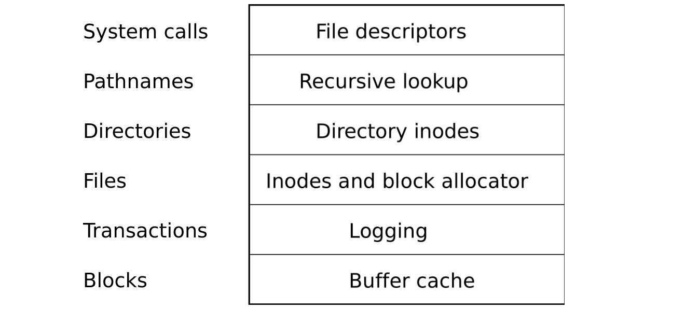

# 概述

> 来源：book-rev7.pdf，第 67–81 页（中文翻译）

xv6 文件系统实现组织为 6 层，如图 6-1 所示。最底层通过缓冲区缓存读写 IDE 磁盘上的块，缓冲区缓存同步对磁盘块的访问，确保同一时刻只有一个内核进程能编辑存储在任何特定块中的文件系统数据。第二层允许高层把对多个块的更新包裹在一个事务中，以确保这些块原子地更新（即全部更新或全部不更新）。第三层提供未命名的文件，每个文件用一个 inode 和保存文件数据的块序列表示。第四层把目录实现为一种特殊的 inode，其内容是目录项序列，每个目录项包含一个名字和对所命名文件的 inode 的引用。第五层使用递归查找提供分层的路径名，如 /usr/rtm/xv6/fs.c。最后一层使用文件系统接口抽象许多 Unix 资源（如管道、设备、文件等），简化应用程序程序员的生活。

（图 6-1：xv6 文件系统的层次——自上而下为：系统调用、路径名、目录/目录 inode、文件/inode 和块分配器、事务/日志、块/缓冲区缓存。）

文件系统必须规划在磁盘上的位置存储 inode 和内容块。为此，xv6 将磁盘划分为几个部分，如图 6-2 所示。文件系统不使用块 0（它保存引导扇区）。块 1 称为超级块（superblock）；它包含有关文件系统的元数据（以块为单位的文件系统大小、数据块数量、inode 数量、日志块数量）。从 2 开始的块保存 inode，每个块容纳多个 inode。之后是位图块，跟踪哪些数据块在用。其余大部分块是数据块，保存文件和目录内容。磁盘末端的块保存日志，它是事务层的一部分。

（图 6-2：xv6 文件系统的结构——块 0 引导，块 1 超级块，块 2 开始 inode，然后是位图，然后是数据……，末尾是日志。头部 fs.h (3650) 包含描述文件系统精确布局的常量与数据结构。）

本章其余部分从底层开始讨论每一层。注意寻找下层精心选择的抽象简化上层设计的例子。