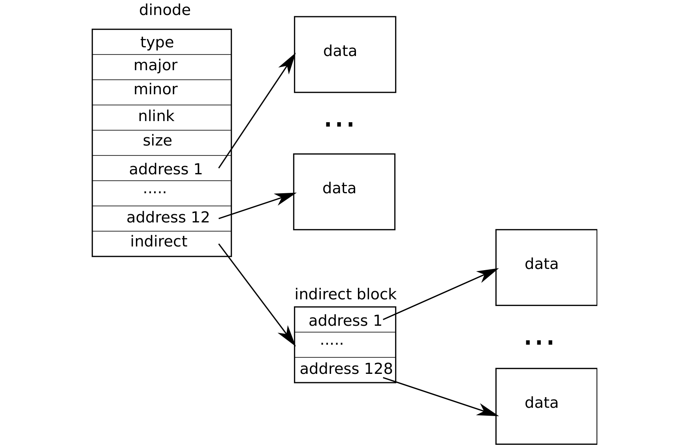

# 代码：inode 内容

> 来源：book-rev7.pdf，第 67–81 页（中文翻译）

磁盘上的 inode 结构 struct dinode 包含一个大小和一个块号数组（见图 6-4）。inode 数据位于 dinode 的 addrs 数组中列出的块中。前 NDIRECT 个数据块列在数组的前 NDIRECT 个条目中；这些块称为直接块。接下来的 NINDIRECT 个数据块不在 inode 中列出，而是在一个称为间接块的数据块中。addrs 数组的最后一个条目给出间接块的地址。因此，文件的前 6 kB（NDIRECT×BSIZE）字节可以从 inode 中列出的块加载，而接下来的 64 kB（NINDIRECT×BSIZE）字节只能在查询间接块之后加载。这是一个良好的磁盘表示，但对客户端来说很复杂。

（图 6-4：文件在磁盘上的表示——dinode 包含 type、major、minor、nlink、size、address 1…address 12；前 12 个直接地址指向数据块；address 12 指向间接块，间接块包含 address 1…address 128，指向更多数据块。）

函数 bmap 管理这种表示，使 readi 和 writei 等高层例程（我们稍后会看到）能够使用它。Bmap 返回 inode ip 的第 bn 个数据块的磁盘块号。如果 ip 还没有这样的块，bmap 分配一个。

函数 bmap (4810) 首先处理简单的情况：前 NDIRECT 个块列在 inode 自身 (4815-4819) 中。接下来的 NINDIRECT 个块列在 ip->addrs[NDIRECT] 处的间接块中。Bmap 读取间接块 (4826)，然后从块中正确位置读取块号 (4827)。如果块号超过 NDIRECT+NINDIRECT，bmap 会 panic：调用者有责任不询问超出范围的块号。

Bmap 根据需要分配块。未分配的块用块号零表示。当 bmap 遇到零时，它用按需分配的新块的块号替换它们（4816-4817、4824-4825）。

Bmap 在 inode 增长时按需分配块；itrunc 释放它们，将 inode 的大小重置为零。itrunc (4856) 首先释放直接块 (4862-4867)，然后释放间接块中列出的块 (4872-4875)，最后释放间接块本身 (4877-4878)。

bmap 使编写访问 inode 数据流的函数变得容易，如 readi 和 writei。readi (4902) 从 inode 读取数据。它首先确保偏移量和计数不会超出文件末尾。从文件末尾之后开始的读取返回错误 (4913-4914)，而从文件末尾开始或跨越文件末尾的读取返回的字节数少于请求 (4915-4916)。主循环处理文件的每个数据块，将数据从缓冲区复制到 dst (4918-4923)。writei (4952) 与 readi 相同，但有三个例外：从或跨越文件末尾开始的写入会扩展文件，直到最大文件大小 (4965-4966)；循环将数据复制到缓冲区而不是复制出来 (4971)；如果写入扩展了文件，writei 必须更新其大小 (4976-4979)。

readi 和 writei 都以检查 ip->type == T_DEV 开始。这种大小写处理其数据不驻留在文件系统中的特殊设备；我们将在文件描述符层回到这种情况。

函数 stati (4423) 将 inode 元数据复制到 stat 结构中，该结构通过 stat 系统调用暴露给用户程序。